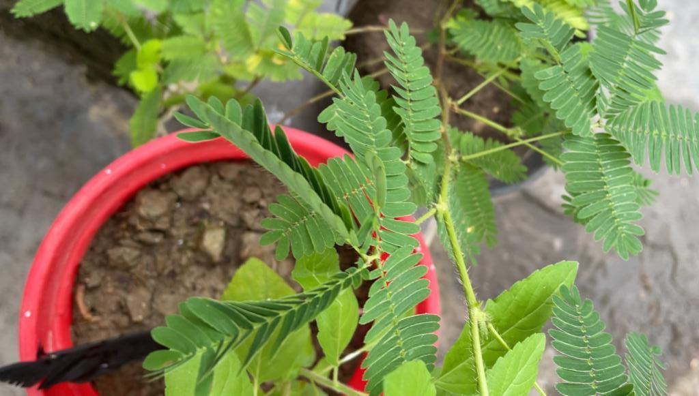

# Mimosa pudica a.k.a *touch-me-not* plant doesn't like to be touched
Few weeks back, I saw a *touch-me-not* plant at my neighbourhood. Within no time, my devil alter ego directed me to poke this sweet looking plant. After playing with it for almost 15-20 mins, I started wondering how does this plant know it is being touched and suddenly fold its leaves inwards to protect its juvenility? My curiosity directed me to do a research about it.

:::info Do you know
Mimosa pudica is known by numerous common names including sensitive plant, humble plant, shameplant, and touch-me-not
:::

## Chemical, Mechanical and Magical ✨

> Documentation in progress