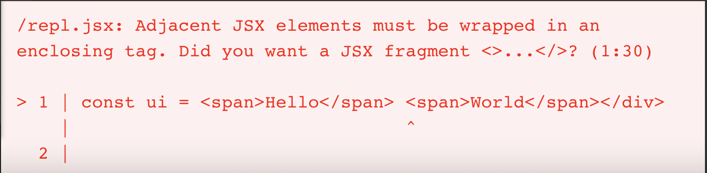

# Syntax error: Adjacent JSX elements must be wrapped in an enclosing tag



## Let's understand how JSX is compiled
:::info
These notes use the Classic React Runtime (old JSX transform) to convert the JSX into the `React.createElement` calls. React 17 introduces a new Automatic React Runtime which helps the compiler to import special function to transpile JSX without importing React into the component. <br />
[Read More](https://legacy.reactjs.org/blog/2020/09/22/introducing-the-new-jsx-transform.html) here about the official announcement. Checkout the [automatic jsx transformation function code here](https://github.com/facebook/react/tree/main/packages/react/src/jsx)
:::

```jsx
const ui = <span className="hello-world">Hello World</span>
```

React uses [Babel](https://babeljs.io/) to transpile the jsx into React's `createElement` function calls.

The above JSX gets transpiled to the code below

```jsx
const ui = React.createElement("span", { className: "hello-world" }, "Hello World");

//or
const ui = React.createElement("span", { className: "hello-world", children: "Hello World" });
```

We can easily identify the syntax of `createElement` from the above snippet

```js
React.createElement(
  type,       // Type of element or component
  [props],    // Optional properties (attributes)
  children,
  children,
  ...         // Child elements or text
);
```

## Let's try to transpile unwrapped JSX elements

Consider the code below having two span tags which are not wrapped in an enclosing tag.

```jsx
const ui = <span>Hello</span><span>World</span>
```

This is how babel will try to transpile it

```jsx
const ui = React.createElement("span", null, "Hello")React.createElement("span", null, "World");
```

As we can see, this is a **syntax error**!

Consider another example of returning unwrapped JSX elements from a component

```jsx
function HelloWorld(props) {
  return <span>Hello</span><span>World</span>;
}
```

This gets transpiled to the code below

```jsx
function HelloWorld(props) {
  return React.createElement("span", null, "Hello")React.createElement("span", null, "World");
}
```

Again, a **syntax error**!

> We need to somehow get rid of the two `createElement` calls and combine them into a single `createElement` call

## Wrap the JSX elements into a parent element

```jsx
function HelloWorld(props) {
  return (
    <div>
      <span>Hello</span>
      <span>World</span>
    </div>
  );
}
```

The above code transpiles to the code below

```jsx
function HelloWorld(props) {
  return (
    React.createElement(
      "div",
      null,
      React.createElement("span", null, "Hello"),
      React.createElement("span", null, "World")
    )
}
```

A valid syntax! ✅

:::info
Above code works but inserts an extra `div` element into the DOM
:::

## React Fragments

React gives us `React.Fragment` component which acts as a parent element to wrap the adjacent JSX elements which inserting any extra elements to the DOM tree.

```jsx
function HelloWorld(props) {
  return (
    <React.Fragment>
      <span>Hello</span>
      <span>World</span>
    </React.Fragment>
  );
}

//or

function HelloWorld(props) {
  return (
    <>
      <span>Hello</span>
      <span>World</span>
    </>
  );
}
```

