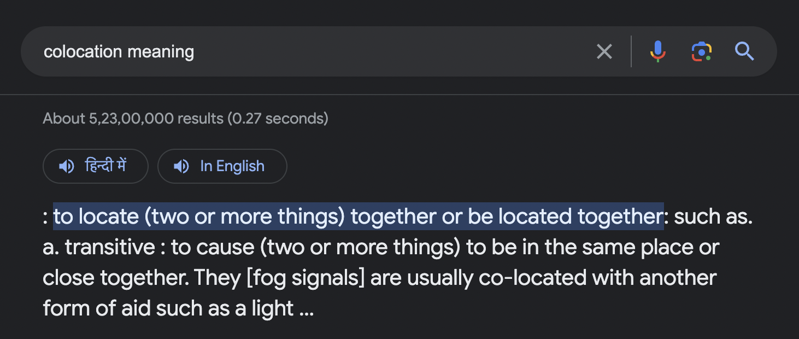

# The concept of state colocation in React

We should try that the component's state should be kept inside the component itself or as close as possible in the component tree. This avoids unnecessary rendering of other components and rerenders only the component whose state is changed.

> State colocation will make the app faster by avoiding rerendering of unaffected components in the tree