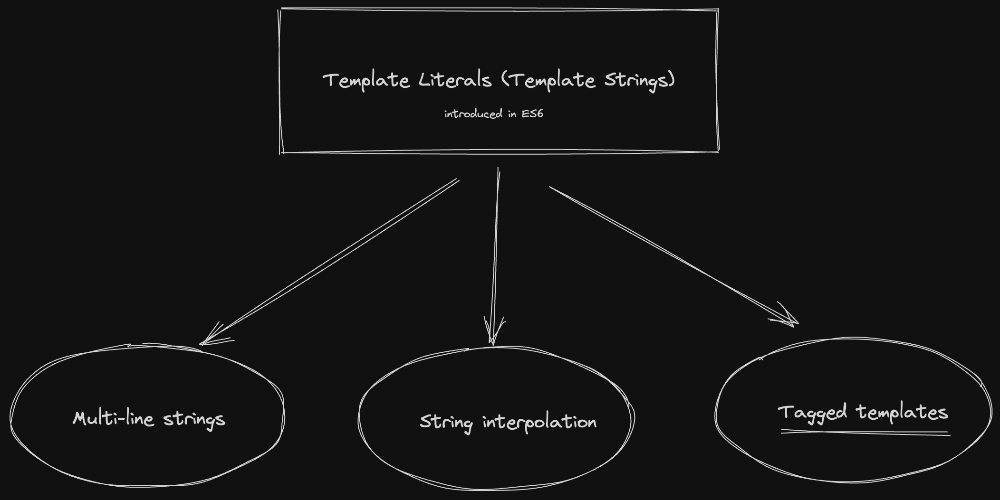
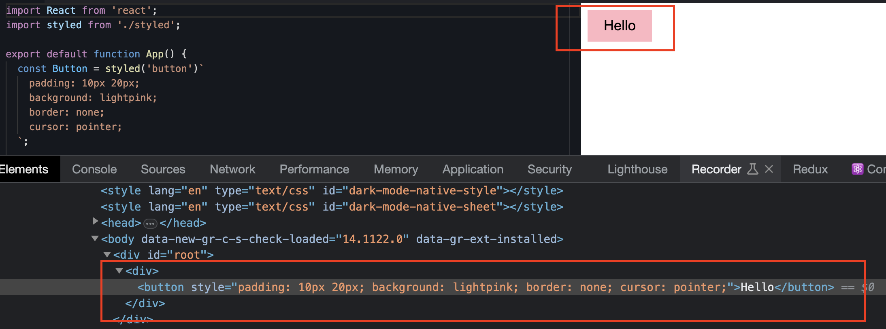

# Tagged Templates in JavaScript

```js {6} showLineNumbers
function sayHello() {
  console.log("Hello, nice to see you!");
}

sayHello(); //logs as expected 😎
sayHello`is this valid?`; //what is this? 😰
```

## The ES6 Template literals
JavaScript is continuously evolving. The ES6 presented a feature called `template literals (template strings)` which provide multiple features and constructs like *multi-line strings*, *string interpolation*, and the one which we are concerned about in this article, ✨ **tagged templates**!



## Tagged Templates
The tagged template construct allows you to pass a template string into a function and return a value. The function is known as a `tag` function and can be named as any other valid function.

:::info
A function becomes a tag function when it is called using `` instead of ()
:::

## Example

```js showLineNumbers
function coolFunc() {
  console.log("I can be a tag function based on my invocation");
}

sayHello(); //coolFunc behaves as a normal function
sayHello``; //coolFunc behaves as a tag function
```

## Tag functions get some cool arguments

The first argument to the tag function is an array of string values and the remaining arguments correspond to the expressions in the template string.


```js showLineNumbers
function tag(stringArr, exp) {
  /**
   * stringArr -> ["Repeat after me, ", " is cool"]
   * exp -> "JavaScript"
  */
  return `${exp}${stringArr[1]}, ${stringArr[0]}please!`
}

let lang = "JavaScript";
tag`Repeat after me, ${lang} is cool`;
// returns 'JavaScript is cool, Repeat after me, please!'
```

By using a tag function, we have the power to manipulate the template string and it's expressions and return something cool!

## Real world usecases

:::tip Have you seen the syntax anywhere?
Our very famous CSS-in-JS library, [styled-components](https://styled-components.com/) uses tagged templates to defined the styled components.

```jsx
const Title = styled.h1`
  font-size: 1.5em;
  text-align: center;
  color: #BF4F74;
`;

render(
  <Title>
    Hello World!
  </Title>
);
```
:::

### Custom styled-components implementation

Let's create a custom implementation of styled-components `styled` function.

The code below is a simple styled function that attaches the component styles into the `style` attributes of the element.

```jsx title="styled.jsx"
import React, { useRef, useEffect } from 'react';

export default function styled(Tag) {
  return function (style) {
    return function (props) {
      const $ref = useRef();

      useEffect(() => {
        $ref.current.style = style[0].replaceAll('\n', '');
      }, []);

      return (
        <Tag ref={$ref} {...props}>
          {props.children}
        </Tag>
      );
    };
  };
}
```

### Usage

```jsx title="App.jsx"
import React from 'react';
import styled from './styled';

export default function App() {
  const Button = styled('button')`
    padding: 10px 20px;
    background: lightpink;
    border: none;
    cursor: pointer;
  `;

  return (
    <div>
      <Button onClick={() => alert('Bare minimum styled-components')}>
        Hello
      </Button>
    </div>
  );
}
```

### Styles are attached to the element's style attribute



## Explore the Stackbiltz preview

<iframe style={{ width: "100%", height: "500px" }} src="https://stackblitz.com/edit/styled-component-implementation?ctl=1&embed=1&file=src%2FApp.js&theme=dark" />